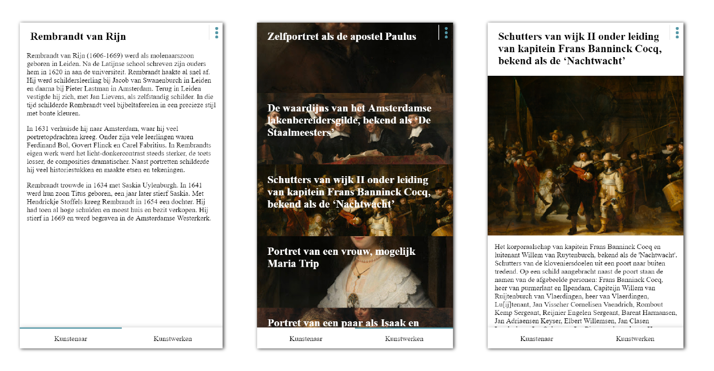

 # Web app for Rijksmuseum

In this repo you can find the app I made from scratch. The app is based on a api from [`Rijksmuseum`](https://www.rijksmuseum.nl/nl/api). The api shows all art pieces from the Rijkmuseum in Amsterdam.


> My work
> [**Velomovies**](https://velomovies.github.io/wafs/app).

## Background

The app shows arts from the Rijksmuseum. It is designed mobile first and works on a lot of devices. In the app you can choose an artist. The artist is remembered by the app. When you refresh it saved your choice. When you visit it for the first time it shows Rembrandt van Rijn. 

On the homepage you find the backstory of any artist. On the section `werken` you can find all the art pieces of a certain artist. When you click on an art piece you can see more info about that piece. Next to that you can see the details of art piece by clicking on the image itself. 

This ensures you can go trough a big part of the Rijksmuseum API.


> The app is mobile first

## Diagram

Below is a image of the Actor diagram for my app. Based on the first iteration of the diagram I made some changes and came up with the diagram below.


> Actor diagram made in illustrator

Basd on the Actor diagram and my code I made an Interaction diagram. You can see in one glance how the app is built.


> Actor diagram made in illustrator

## Data

The app uses the api of [`Rijksmuseum`](https://www.rijksmuseum.nl/nl/api). The api is really big and it is recently updated but it does not have a extensive readme. Most of the queries that I had to use, I had to try myself.

Because the api recently updated, the data that returned was really clean. I easily could change the api call and use a lot of parameters to get the data I wanted.

The queries I used where:
```
https://www.rijksmuseum.nl/api/pages/nl/rijksstudio/kunstenaars/rembrandt-van-rijn?key=rS2jUIgJ&format=json

https://www.rijksmuseum.nl/api/nl/collection/?principalMaker=Rembrandt+van+Rijn&ps=100&p=1&key=rS2jUIgJ&format=json

https://www.rijksmuseum.nl/api/nl/collection/SK-A-4050?key=rS2jUIgJ&format=json
```

The name of the artist may vary by your own choice

## Features

Most of the features I wanted in this app I implemented succesfully. Below is a little list of some features I would like to have.
* Search function to search a artist and see their art pieces
* A way to select art pieces from a specific date
* Show a image per artist in the home section
* A slick design

# Assignment (in dutch)

## Advantages and disadvantages of JavaScript libraries/frameworks

Javascript frameworks worden veel gebruikt. Het is dan ook niet zo dat er maar één soort framework bestaat. Er zijn heel veel verschillende javascript frameworks en worden op veel uiteenlopende manieren gebruikt. Dit heeft zo zijn voordelen en nadelen. Hieronder zet ik mijn bevindingen over deze 

Voordelen | Nadelen
--- | --- 
Frameworks zijn tools die zorgen dat het werk sneller en beter kan maken. | Frameworks zijn vaak grote bestanden die de website niet sneller maken.
Als beginner kan het je helpen om efficiënter en makkelijker te komen tot een product. | Frameworks zijn door anderen gemaakt dus je hebt niet zelf in de hand of deze wordt upgedate of dat je na een jaar in een dood ecosysteem werkt. 
Er bestaat vaak grote online communities die de frameworks verbeteren. | Er is niet altijd een goede uitleg over hoe iets werkt.
Het maakt Javascript overzichtelijker, omdat je minder code hoeft te schrijven. | De achterliggende code is vaak ingewikkeld.
De Javascript is beter leesbaar. | Het is niet in jouw hand hoe veilig een framework is.
 | Frameworks kunnen ervoor zorgen dat je beperkt wordt in wat je wil.
 | Het kost veel (kostbare) tijd om een framework te leren.

Of je frameworks moet gebruiken ligt aan het project. Het beste is om per project te bekijken of het écht nodig is om een framework te gebruiken. Zoals je hierboven kon lezen heeft het genoeg voor- en nadelen, maar ze zullen soms niet allemaal toepassen op een bepaald project.


## Advantages and disadvantages of client-side single page web apps

Webapps worden tegenwoordig steeds vaker gemaakt en gebruikt. Het is een webapplicatie die te vergelijken is met een computerprogramma die op de computer zelf draait. Het maken van web apps gebeurt veelal in HTML. Deze manier van het het gebruiken van een programma/website heeft zo zijn voordelen en nadelen.

Voordelen | Nadelen
--- | --- 
Bij het gebruiken van een applicatie wordt er niet veel data gebruikt. | De resources worden maar één keer geladen. (lastig met updaten)
De resources worden maar één keer geladen. (Snel in gebruik) | Het eerst downloaden duurt lang.
Het is makkelijker te maken. (De backend code kan hergebruikt worden) | Minder veilig door Cross-Site Scripting (XSS)
 | Normale dingen uit de browser werken niet meer (herladen, bookmarking, verzenden van een link of openen van een nieuwe tab)

Het gebruik van Single-page Web apps is aan te raden voor bepaalde projecten. Eigenlijk geldt er hier dat je het goed moet bekijken per project. Het ligt heel erg aan de grootte en het doel wat je wil bereiken met het project. 


## Best practices
* Don't use global variables/objects
* Declare variables at top of scope
* Use short clear meaningful names `English`
* Work in strict mode
* Don't use semicolon
* Use two spaces as tab
* camelCase your code `if (code != Constructor || CONSTANTS)`
* Place external scripts at the bottom of the page
* Indent your code
* Commit often, push once

## Sources

### JavaScript libraries/frameworks
> Door [Smuel Andras](https://blog.hellojs.org/javascript-frameworks-why-and-when-to-use-them-43af33d0608d) op 14 februari 2017 https://blog.hellojs.org/javascript-frameworks-why-and-when-to-use-them-43af33d0608d

> Door [Sean Fioritto](https://www.planningforaliens.com/blog/2016/06/09/when-to-use-a-js-framework) op 6 september 2016 https://www.planningforaliens.com/blog/2016/06/09/when-to-use-a-js-framework

### Client-side single page web apps
> Door [Neoteric](https://medium.com/@NeotericEU/single-page-application-vs-multiple-page-application-2591588efe58) op 2 december 2016 https://medium.com/@NeotericEU/single-page-application-vs-multiple-page-application-2591588efe58

> Door Stevan [Tilkov](https://medium.freecodecamp.org/why-i-hate-your-single-page-app-f08bb4ff9134) op 13 januari 2016 https://medium.freecodecamp.org/why-i-hate-your-single-page-app-f08bb4ff9134

## Pull Requests

> Pull request (week 1) bij [Jelle Overbeek](https://github.com/jelleoverbeek/wafs/pull/1)

> Pull request (week 1) bij [Koos Bavinck](https://github.com/hackshackshacks/wafs/pull/2)

> Pull request (week 2) bij [Vienna Meijer](https://github.com/ViennaM/wafs/pull/2)

## License

GPL-3.0 © Victor Zumpolle